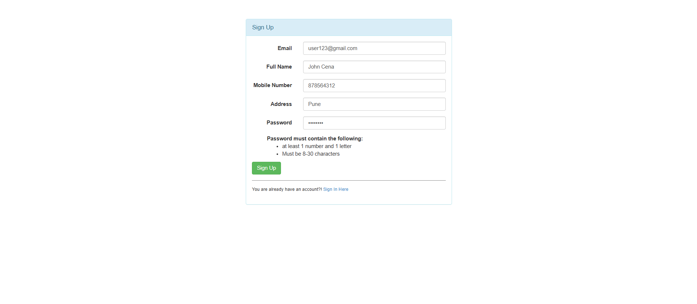
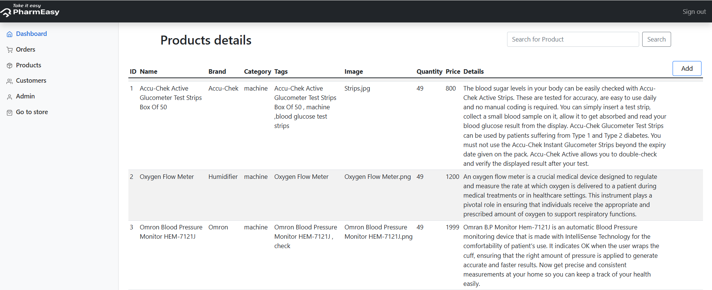
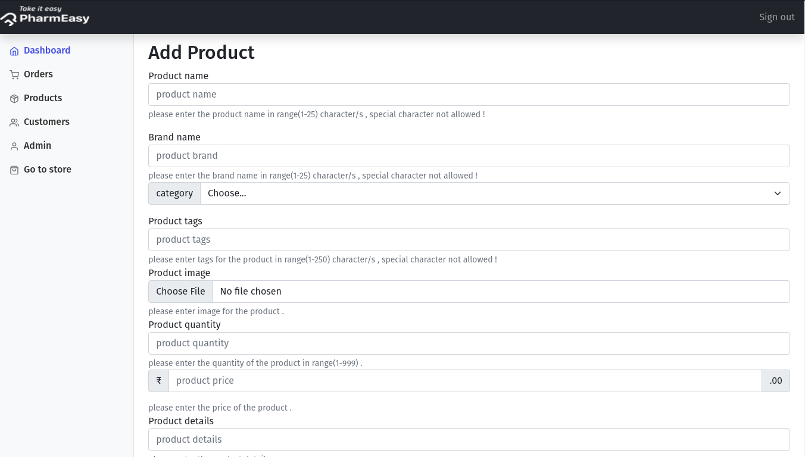
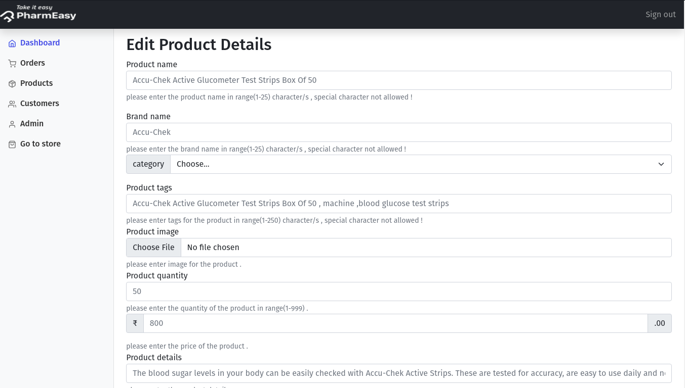
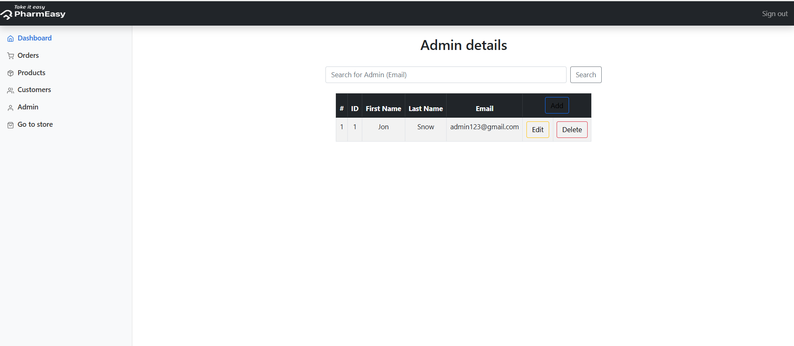

# PharmEasy.com
## This project was made for DBMS laboratory subject as a mini project by usining pure php language for 5th semester , which it represent an online pharmacy store.
## Main page:

## Functionality
* ### user log in :

* ### user sign up :

* ### search :

* ### product :

* ### cart :

* ### order confirmation :

* ### admin home :

* ### admin log in :

* ### orders details and mangement :

* ### Products details :

* ### add new Product :

* ### edit Product :

* ### search for Product :

* ### customers details :

* ### edit customer :

* ### search for customer :

* ### admins details :

* ### add new admin account :

* ### edit admin :

* ### search for admin :

### the infront-end has done with help of @mdfaisalahmed057
