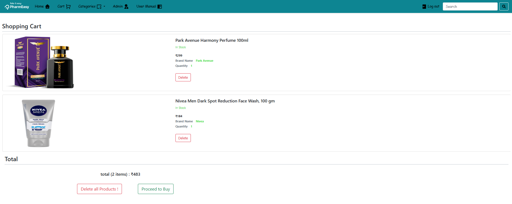
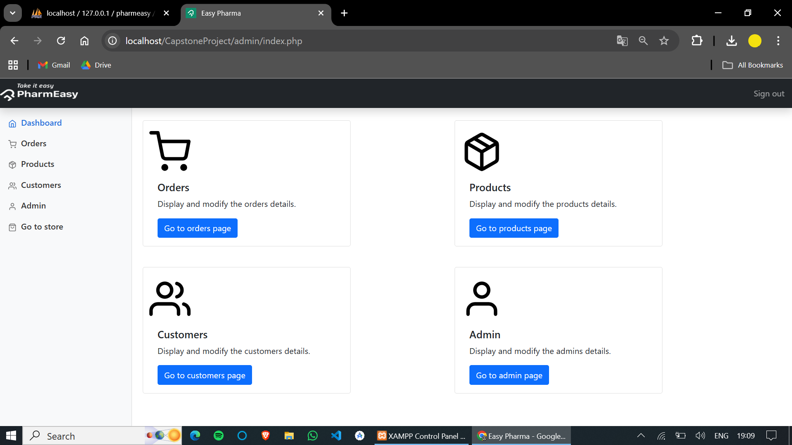
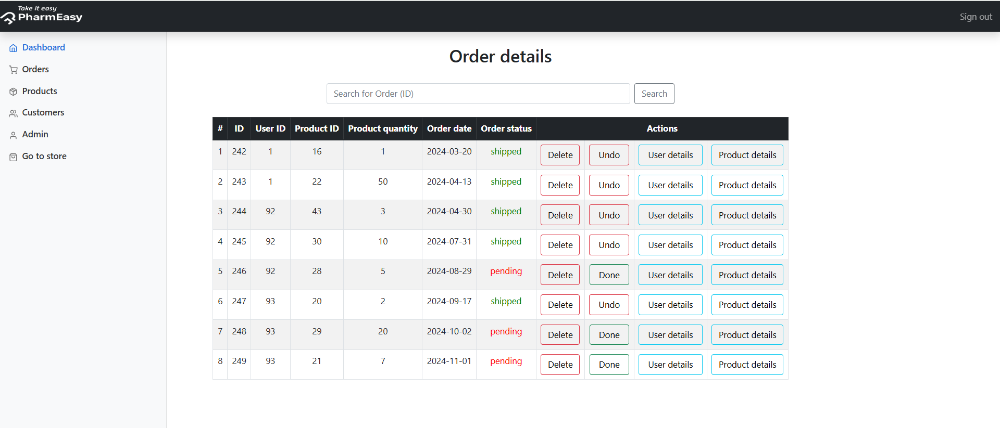
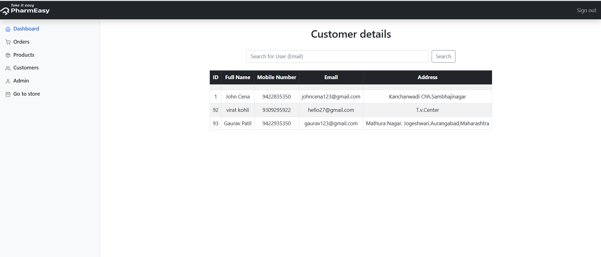
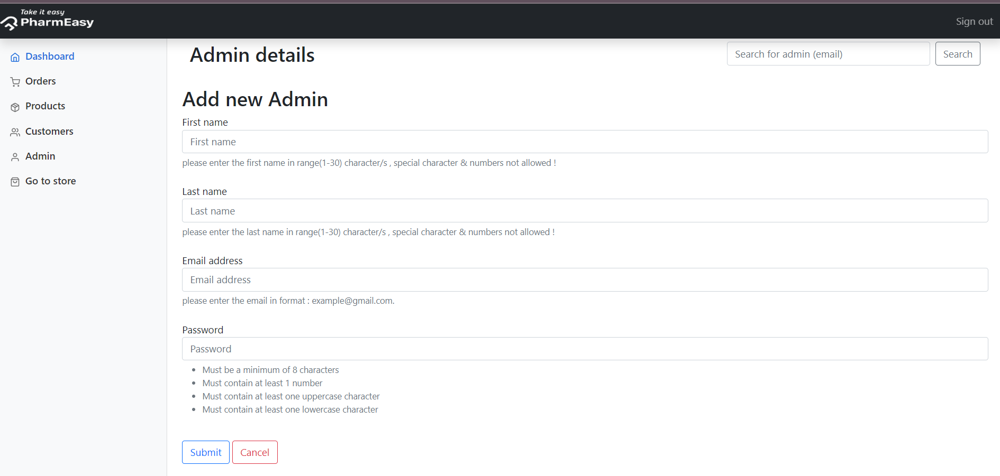
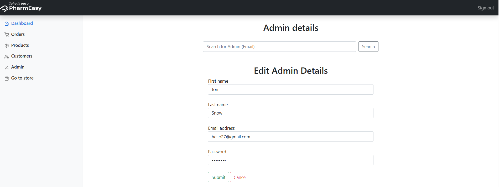

# PharmEasy.com
## This project was developed as a DBMS Laboratory mini project during the 5th & 6th semester, using pure PHP for implementation. It represents an online pharmacy store that demonstrates database integration and web application development.
## Main page:

## Functionality
* ### User Login :

* ### User Signup :

* ### Product :

* ### Cart :

* ### Order Confirmation :

* ### Admin Home :

* ### Order Details and Mangement :

* ### Products Details :

* ### Add New Product :

* ### Edit Product :

* ### Search for Product :

* ### Customers Details :

* ### Edit Customer :

* ### Admins Details :

* ### Add New Admin Account :

* ### Edit Admin :

